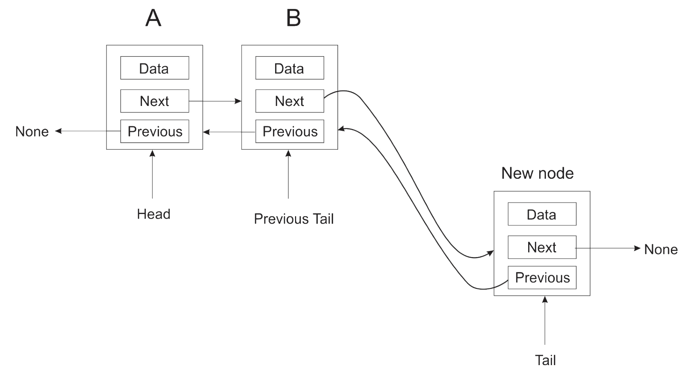
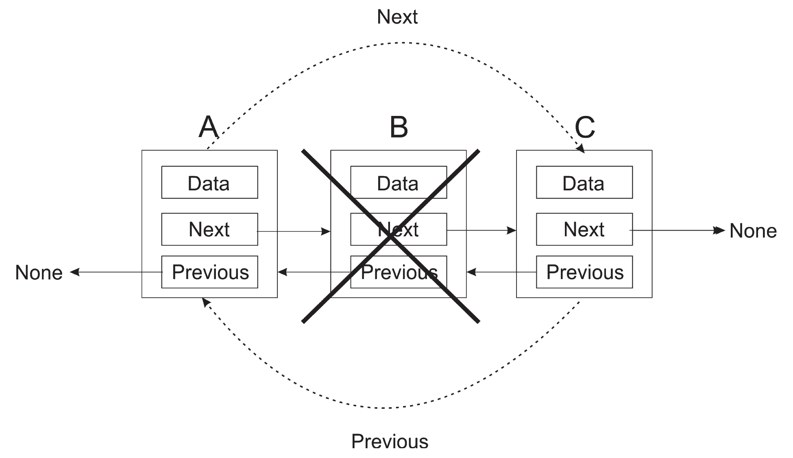
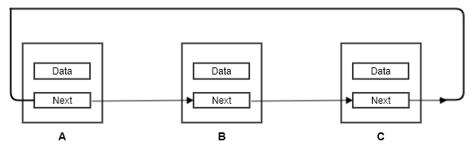
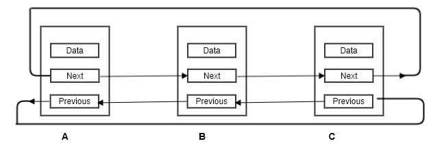

[Back](../README.md)

## Linked list
- The list is an important and popular data structure
- There are three kind of list
    1. [Singly Linked list](./singly_linked_list.py)
        - A list with only one pointer b/w two successive nodes
        - it can only be travrsed in a single direction
    2. [Doubly Linked list](./doubly_linked_list.py)
        - It is similar to singly linked list except the fact that its node has two pointers, each pointing to next and previous node respectively
        - It can be traversed in any direction
        - Appending a node visual representation
        
        - Deleting a node visual representation
        

    3. [Circularly Linked list](./circularly_linked_list.py)
        - It is a special case of linked list where endpoints are connected with each other i.e. In Circular linked list tail is pointing to head, as shown in image below
        
        - we can implement CLL either using a singly-linked list node or doubly-linked list node
        
- I will also show various important opeations that can be performent on these lists:
    - append
    - delete
    - traversing
    - searching